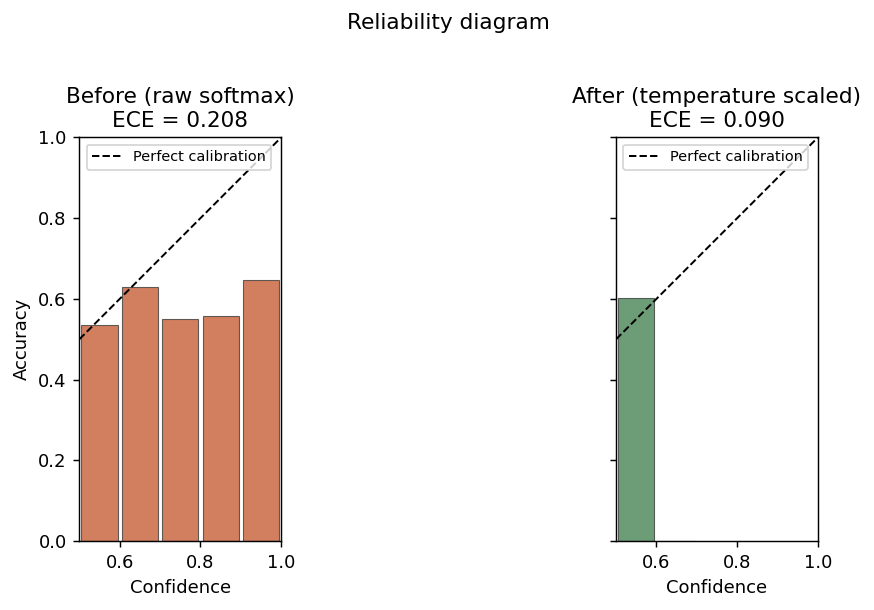
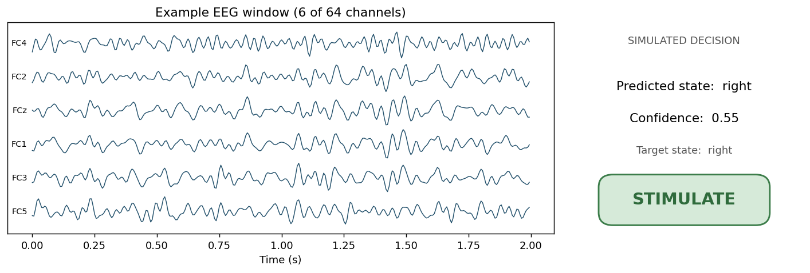

# NeuroLoop-Lite
**EEG motor-imagery classification with confidence-aware, simulated closed-loop decisions.**

A small research-engineering demo of the full path from public EEG to an
uncertainty-gated decision: preprocess EEG, train one tiny 1D CNN to read a
brain-state label, measure confidence, and let that confidence gate a simulated
`STIMULATE / WAIT` controller. The classifier is deliberately small and only
modestly above chance — the point is the end-to-end pipeline and its uncertainty
analysis, not a state-of-the-art EEG model.

## At a glance
<!-- METRICS_START -->
- **Dataset:** PhysioNet EEG Motor Movement/Imagery (EEGMMIDB)
- **Model:** TinyEEGCNN (57,954 params)
- **EEG windows:** 900 (180 in held-out test)
- **Balanced accuracy:** 0.600
- **ECE (raw &rarr; calibrated):** 0.208 &rarr; 0.090  (T = 35.99)
- **Accuracy (most-confident 20%):** 0.694
<!-- METRICS_END -->


## Pipeline
Public EEG (EEGMMIDB, motor imagery) -> band-pass 7-30 Hz -> fixed 2 s windows
(64 channels x 320 samples) -> tiny 1D CNN -> predicted state + softmax
confidence -> simulated decision.

- **Dataset:** EEGMMIDB via MNE (no registration). Runs 4/8/12, imagined
  **left vs right fist**. ~20 subjects (~100-200 MB, cached after first run).
- **Model:** `TinyEEGCNN`, ~58k params. No transformers, ensembles, or sweeps.
- **Split:** subject-wise — test subjects are never seen in training, so 60% is a
  genuine held-out number rather than window-level leakage.
- **Controller:** for this retrospective demo, the controller acts on the highest-
  confidence fraction specified by `--coverage` (default 0.30). A deployed system
  would set its confidence threshold from validation data before test evaluation.
  `STIMULATE` is only produced when the predicted state matches the chosen target.

## What it shows
**Confidence can gate decisions — the main result.** Acting on every test window
gives 60.0% accuracy. Across the evaluated coverage levels, accuracy increased
monotonically as the controller became more selective: 60.0 -> 61.8 -> 62.0 ->
65.3 -> 69.4% as coverage fell from 100 -> 80 -> 60 -> 40 -> 20%. The model's
confidence therefore carries useful ranking information about which predictions
are more likely to be correct, even though the classifier itself is weak. The
20% point contains only ~36 windows, so the trend matters more than that single
endpoint.


**Calibration reduces confidence miscalibration.** Raw softmax was strongly
over-confident (ECE 0.208). Temperature scaling — one scalar `T` fit on validation
— reduced ECE to 0.090 without changing any class prediction or the confidence
ranking above. Because temperature scaling is monotone, the risk-coverage gain
comes from the original ranking; calibration changes the numerical confidence
values. `T` is large (~36), which reflects severe over-confidence and compresses
calibrated confidence near 0.5. The right interpretation is therefore that
measured calibration error was substantially reduced, while the confidence range
remains narrow because the classifier is relatively weak.



**A tangible example** — one EEG window, its predicted state and confidence, and
the resulting simulated decision:



## Run it
```bash
python -m pip install -r requirements.txt
python run_demo.py --prepare
python run_demo.py
python run_demo.py --prepare --quick
```

Runs on an RTX 4090 in a couple of minutes (CPU is fine too). Flags:
`--quick`, `--epochs`, `--target {left,right}`, `--coverage`, `--seed`.

## Outputs
`figures/`: pipeline, risk_coverage, calibration, confusion_matrix, example_decision.
`results/summary.json` contains aggregate metrics and the risk-coverage sweep;
`results/results.csv` contains per-window predictions, confidence and decisions.

## Disclaimer
Small research-engineering demonstration. The closed-loop decision is **simulated**
and is **not** intended for clinical use or real brain stimulation.
