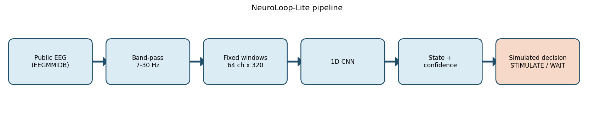
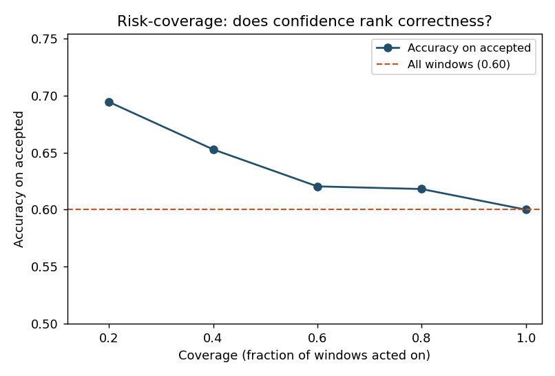

# NeuroLoop-Lite

### Can EEG confidence safely gate a simulated closed-loop decision?

A small ML-engineering demo using public EEG data, a tiny 1D CNN, confidence calibration, and a simulated `STIMULATE / WAIT` controller.

**900 EEG windows · subject-wise split · 60.0% balanced accuracy · 69.4% accuracy on the most-confident 20%**



## Result

I tested `TinyEEGCNN` on PhysioNet EEG Motor Movement/Imagery (EEGMMIDB), classifying imagined **left vs right fist** from 64-channel EEG.

| Metric | Result |
|---|---:|
| Balanced accuracy | **60.0%** |
| ECE, raw → calibrated | **0.208 → 0.090** |
| Accuracy at 40% coverage | **65.3%** |
| Accuracy at 20% coverage | **69.4%** |

The classifier itself is modest, but confidence still ranks predictions usefully: accuracy increased as the controller became more selective. Temperature scaling reduced measured calibration error without changing prediction ranking.



## Run it

```bash
python -m pip install -r requirements.txt
python run_demo.py --prepare
python run_demo.py
```

Outputs are written to `results/` and `figures/`.

> **Note:** This is a small research-engineering demonstration. The closed-loop decision is simulated and is not intended for clinical use or real brain stimulation.
